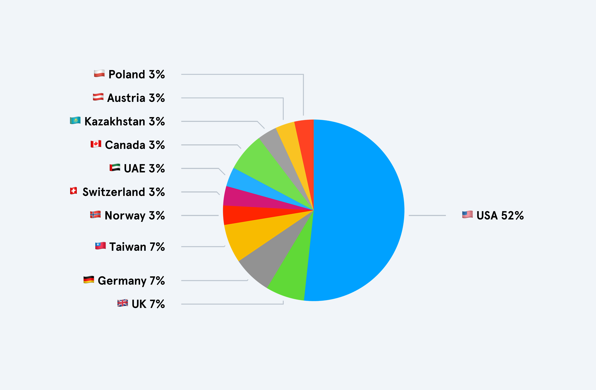
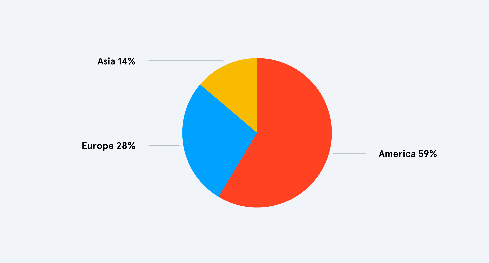
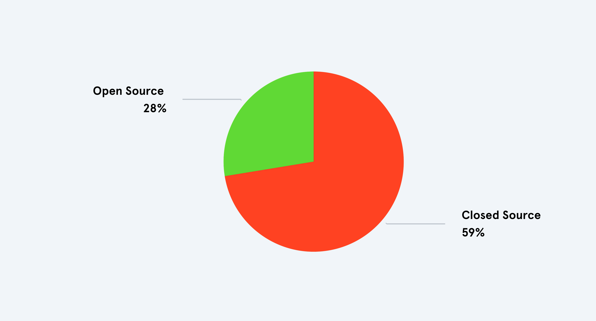

## What is it about?

I've listed all software and services that I currently use on regular basis (as of March 2025),
added where they are from and if they are open source. Inspired by /uses pages on other personal
websites[^1].

## But why?

As a member of a (capitalist) society, one of the key ways you influence its structure is by making
choices about the products you consume/purchase. When it comes to groceries, I already pay (some)
attention to the origin of food products and whether they are sourced locally or from the other side
of the globe. However, I’ve realized that in the digital space in which I spend a lot of time and in
which my daily work takes place, I haven’t given it much thought until now. I have the feeling that,
especially in the current times when the CEOs of large tech companies are not taking a political
stance or following power-hungry autocrat, it makes more sense than ever before to think about the
origin of the digital products that we use every day.

But it is important to say, that I do not want to make a blanket statement that software that comes
from the US, Russia or China is worse or more morally reprehensible than software that comes from
Europe, for example. In this overview I primarily want to get an idea from which countries the
software comes from and what the ratio is. This way, I (hopefully) can make better decisions about
whether I feel safe sharing my sensitive data with them or giving them my money and attention.

## What I use

I’ve listed all the software I regularly use on both desktop (MacOS) and mobile (iOS) and tried to
organize them into different categories.

### 🤖 Development

<table class="mt-10 mb-20">
  <thead>
    <tr>
      <th style="text-align: left; width: 20%">Software</th>
      <th style="text-align: left; width: 40%">Description</th>
      <th style="text-align: left; width: 25%">Location</th>
      <th style="text-align: right; width: 15%">Open Source</th>
    </tr>
  </thead>
  <tbody>
    <tr>
      <td style="text-align: left"><strong>VSCode</strong></td>
      <td style="text-align: left">IDE of my choice</td>
      <td style="text-align: left">🇺🇸 USA – Redmond</td>
      <td  style="text-align: right">✅
        <label class="margin-toggle sidenote-number" for="sn-0">
        </label>
        The core of VS Code is open source and is licensed under the MIT license. However, the official version released by Microsoft contains proprietary elements, such as extensions and branding.
      </td>
    </tr>
    <tr>
      <td style="text-align: left"><strong>Zed</strong></td>
      <td style="text-align: left">new IDE I'm currently trying out</td>
      <td style="text-align: left">🇺🇸 USA – San Francisco</td>
      <td class="pr-2.5" style="text-align: right">✅</td>
    </tr>
    <tr>
      <td style="text-align: left"><strong>Hyper</strong></td>
      <td style="text-align: left">Electron-based terminal emulator</td>
      <td style="text-align: left">🇺🇸 USA – San Francisco</td>
      <td class="pr-2.5" style="text-align: right">✅</td>
    </tr>
    <tr>
      <td style="text-align: left"><strong>Docker</strong></td>
      <td style="text-align: left">Containerization platform</td>
      <td style="text-align: left">🇺🇸 USA – Palo Alto</td>
      <td class="pr-2.5" style="text-align: right">✅</td>
    </tr>
  </tbody>
</table>

### 📐 Design/Photography

<table class="mt-10 mb-20">
  <thead>
    <tr>
      <th style="text-align: left; width: 20%">Software</th>
      <th style="text-align: left; width: 40%">Description</th>
      <th style="text-align: left; width: 25%">Location</th>
      <th style="text-align: right; width: 15%">Open Source</th>
    </tr>
  </thead>
  <tbody>
    <tr>
      <td style="text-align: left"><strong>Figma</strong></td>
      <td style="text-align: left">Design tool for mainly everything</td>
      <td style="text-align: left">🇺🇸 USA – San Francisco</td>
      <td class="pr-2.5" style="text-align: right">❌</td>
    </tr>
    <tr>
      <td style="text-align: left"><strong>Adobe Lightroom</strong></td>
      <td style="text-align: left">Photo editing + organisation</td>
      <td style="text-align: left">🇺🇸 USA – San Jose</td>
      <td class="pr-2.5" style="text-align: right">❌</td>
    </tr>
    <tr>
      <td style="text-align: left"><strong>Affinity Designer</strong></td>
      <td style="text-align: left">Design tool for vector stuff</td>
      <td style="text-align: left">🇬🇧 UK – Nottingham</td>
      <td class="pr-2.5" style="text-align: right">❌</td>
    </tr>
    <tr>
      <td style="text-align: left"><strong>Inkscape</strong></td>
      <td style="text-align: left">Vector Design tool to control my pen plotter</td>
      <td style="text-align: left">🌍 Community-driven</td>
      <td class="pr-2.5" style="text-align: right">✅</td>
    </tr>
    <tr>
      <td style="text-align: left"><strong>Eagle</strong></td>
      <td style="text-align: left">Digital asset and inspiration manager</td>
      <td style="text-align: left">🇹🇼 Taiwan</td>
      <td class="pr-2.5" style="text-align: right">❌</td>
    </tr>
  </tbody>
</table>

### 🗞️ Media/Social media

<table class="mt-10 mb-20">
  <thead>
    <tr>
      <th style="text-align: left; width: 20%">Software</th>
      <th style="text-align: left; width: 40%">Description</th>
      <th style="text-align: left; width: 25%">Location</th>
      <th style="text-align: right; width: 15%">Open Source</th>
    </tr>
  </thead>
  <tbody>
    <tr>
      <td style="text-align: left"><strong>Mastodon</strong></td>
      <td style="text-align: left">decentralized social network</td>
      <td style="text-align: left">🇩🇪 Germany – Jena</td>
      <td class="pr-2.5" style="text-align: right">✅</td>
    </tr>
    <tr>
      <td style="text-align: left"><strong>Tidal</strong></td>
      <td style="text-align: left">Music streaming</td>
      <td style="text-align: left">🇳🇴 Norway – Oslo
            <label class="margin-toggle sidenote-number" for="sn-0"></label>
            TIDAL was founded in Norway by Aspiro but later acquired by a group of artists led by Jay-Z. Today, it is majority-owned by Block, Inc. (USA), though its origins remain Norwegian.
        </td>
      <td class="pr-2.5" style="text-align: right">❌</td>
    </tr>
    <tr>
      <td style="text-align: left"><strong>Pocket Casts</strong></td>
      <td style="text-align: left">Podcast player</td>
      <td style="text-align: left">🇺🇸 USA – San Francisco</td>
      <td class="pr-2.5" style="text-align: right">❌</td>
    </tr>
    <tr>
      <td style="text-align: left"><strong>Reeder</strong></td>
      <td style="text-align: left">RSS reader</td>
      <td style="text-align: left">🇨🇭 Switzerland</td>
      <td class="pr-2.5" style="text-align: right">❌</td>
    </tr>

  </tbody>
</table>

### 💬 Communication

<table class="mt-10 mb-20">
  <thead>
    <tr>
      <th style="text-align: left; width: 20%">Software</th>
      <th style="text-align: left; width: 40%">Description</th>
      <th style="text-align: left; width: 25%">Location</th>
      <th style="text-align: right; width: 15%">Open Source</th>
    </tr>
  </thead>
  <tbody>
    <tr>
      <td style="text-align: left"><strong>Slack</strong></td>
      <td style="text-align: left">chat for work</td>
      <td style="text-align: left">🇺🇸 USA – San Francisco</td>
      <td class="pr-2.5" style="text-align: right">❌</td>
    </tr>
    <tr>
      <td style="text-align: left"><strong>Discord</strong></td>
      <td style="text-align: left">communities</td>
      <td style="text-align: left">🇺🇸 USA – San Francisco</td>
      <td class="pr-2.5" style="text-align: right">❌</td>
    </tr>
    <tr>
      <td style="text-align: left"><strong>Signal</strong></td>
      <td style="text-align: left">preferred private chat</td>
      <td style="text-align: left">🇺🇸 USA – Mountain View</td>
      <td class="pr-2.5" style="text-align: right">✅</td>
    </tr>
    <tr>
      <td style="text-align: left"><strong>WhatsApp</strong></td>
      <td style="text-align: left">private chat I want to ditch</td>
      <td style="text-align: left">🇺🇸 USA – Menlo Park</td>
      <td class="pr-2.5" style="text-align: right">❌</td>
    </tr>
    <tr>
      <td style="text-align: left"><strong>Telegram</strong></td>
      <td style="text-align: left">private chat I want to ditch</td>
      <td style="text-align: left">🇦🇪 UAE – Dubai
        <label class="margin-toggle sidenote-number" for="sn-0"></label>
        Telegram is officially headquartered in Dubai, but its origins trace back to Russia. Over the years, the company has relocated multiple times, primarily due to regulatory and privacy concerns.
      </td>
      <td class="pr-2.5" style="text-align: right">❌</td>
    </tr>
  </tbody>
</table>

### 🗂️ Organisation/Notes

<table class="mt-10 mb-20">
  <thead>
    <tr>
      <th style="text-align: left; width: 20%">Software</th>
      <th style="text-align: left; width: 40%">Description</th>
      <th style="text-align: left; width: 25%">Location</th>
      <th style="text-align: right; width: 15%">Open Source</th>
    </tr>
  </thead>
  <tbody>
    <tr>
      <td style="text-align: left"><strong>Obsidian</strong></td>
      <td style="text-align: left">Markdown note taking tool</td>
      <td style="text-align: left">🇨🇦 Canada
        <label class="margin-toggle sidenote-number" for="sn-0"></label>
        Obsidian is developed by Dynalist Inc., a company based in Canada.</td>
      <td class="pr-2.5" style="text-align: right">❌</td>
    </tr>
    <tr>
      <td style="text-align: left"><strong>Apple Mail</strong></td>
      <td style="text-align: left">mail client</td>
      <td style="text-align: left">🇺🇸 USA – Cupertino</td>
      <td class="pr-2.5" style="text-align: right">❌</td>
    </tr>
    <tr>
      <td style="text-align: left"><strong>Apple Calendar</strong></td>
      <td style="text-align: left">calendar client</td>
      <td style="text-align: left">🇺🇸 USA – Cupertino</td>
      <td class="pr-2.5" style="text-align: right">❌</td>
    </tr>
    <tr>
      <td style="text-align: left"><strong>Raindrop</strong></td>
      <td style="text-align: left">Bookmark manager</td>
      <td style="text-align: left">🇰🇿 Kazakhstan</td>
      <td class="pr-2.5" style="text-align: right">❌</td>
    </tr>
  </tbody>
</table>

### ⚫ General/Misc

<table class="mt-10 mb-20">
  <thead>
    <tr>
      <th style="text-align: left; width: 20%">Software</th>
      <th style="text-align: left; width: 40%">Description</th>
      <th style="text-align: left; width: 25%">Location</th>
      <th style="text-align: right; width: 15%">Open Source</th>
    </tr>
  </thead>
  <tbody>
    <tr>
      <td style="text-align: left"><strong>Zen Browser</strong></td>
      <td style="text-align: left">Current browser of my choice (firefox fork)</td>
      <td style="text-align: left">-</td>
      <td class="pr-2.5" style="text-align: right">✅</td>
    </tr>
    <tr>
      <td style="text-align: left"><strong>Raycast</strong></td>
      <td style="text-align: left">Mac OS spotlight alternative</td>
      <td style="text-align: left">🇬🇧 UK – Cheshire</td>
      <td class="pr-2.5" style="text-align: right">❌</td>
    </tr>
    <tr>
      <td style="text-align: left"><strong>MoneyMoney</strong></td>
      <td style="text-align: left">Personal finance management app</td>
      <td style="text-align: left">🇩🇪 Germany – Düsseldorf</td>
      <td class="pr-2.5" style="text-align: right">❌</td>
    </tr>
    <tr>
      <td style="text-align: left"><strong>1Password</strong></td>
      <td style="text-align: left">Password manager</td>
      <td style="text-align: left">🇨🇦 Canada – Toronto</td>
      <td class="pr-2.5" style="text-align: right">❌</td>
    </tr>
    <tr>
      <td style="text-align: left"><strong>Yoink</strong></td>
      <td style="text-align: left">Drag-and-drop file manager</td>
      <td style="text-align: left">🇦🇹 Austria – Vienna</td>
      <td class="pr-2.5" style="text-align: right">❌</td>
    </tr>
    <tr>
      <td style="text-align: left"><strong>CleanShot</strong></td>
      <td style="text-align: left">Tool for making screenshots/screen recordings</td>
      <td style="text-align: left">🇵🇱 Poland</td>
      <td class="pr-2.5" style="text-align: right">❌</td>
    </tr>
    <tr>
      <td style="text-align: left"><strong>Synology Drive</strong></td>
      <td style="text-align: left">File syncing and sharing solution for my Synology NAS</td>
      <td style="text-align: left">🇹🇼 Taiwan – Taipei</td>
      <td class="pr-2.5" style="text-align: right">❌</td>
    </tr>
    <tr>
      <td style="text-align: left"><strong>Backblaze</strong></td>
      <td style="text-align: left">Cloud backup service for all my NAS data</td>
      <td style="text-align: left">🇺🇸 USA – San Mateo</td>
      <td class="pr-2.5" style="text-align: right">-</td>
    </tr>
    <tr>
      <td style="text-align: left"><strong>Strava</strong></td>
      <td style="text-align: left">Tracking app for cycling and running</td>
      <td style="text-align: left">🇺🇸 USA – San Francisco</td>
      <td class="pr-2.5" style="text-align: right">-</td>
    </tr>
  </tbody>
</table>

## The ratio

<figcaption>Distribution by Country</figcaption>

<figcaption>Distribution by Continent</figcaption>

<figcaption style="margin-bottom: 120px !important">Distribution by Software Licensing Models</figcaption>

## My conculsion

There isn’t a clear conclusion — at least not one that leads to immediate action. While it's
striking that 52% of the software I use comes from the US, I’m pleasantly surprised by the variety
of countries represented.

Still, two patterns stand out and give me pause:

First, every piece of software I rely on professionally to earn a living as a developer comes from
the US. As far as I know, there are no serious alternatives that wouldn’t disrupt my workflow and
significantly reduce my productivity.

Second, I’m uneasy about the origins of the communication tools I use daily. I’d prefer European
alternatives due to their stronger data protection laws, but, as with social media platforms,
getting people to switch is difficult. Familiarity and widespread adoption keep users locked into
existing services, making it hard to transition to what might actually be a better option.

Perhaps this blog post encourages you to take a moment to consider where the software you use every
day comes from and what impact that has — especially when it comes to data privacy. The choices we
make, even when they seem small, shape the digital world we rely on.

[^1]:
    I love exploring /uses pages on personal websites and always find it fascinating to see what
    tools others rely on. It’s a great way to discover new software I might not have known about. A
    great collection of such pages can be found at [uses.tech](https://uses.tech/).

