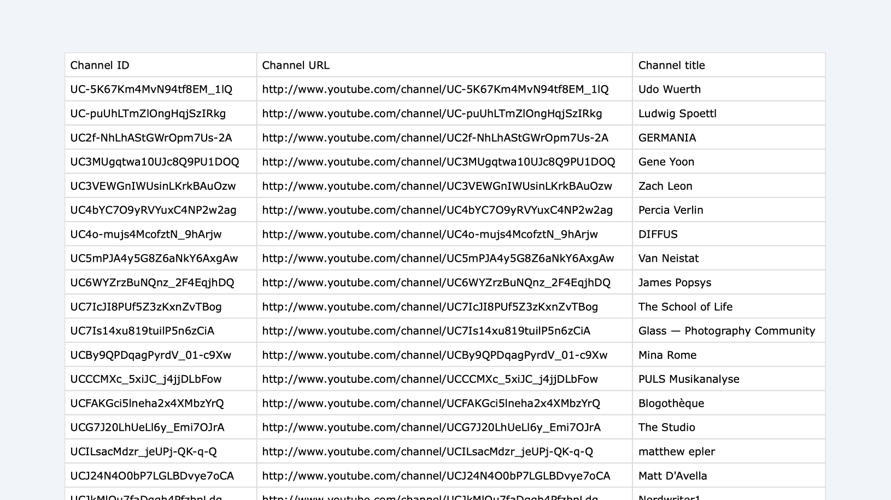

I want to share my approach to reducing the time I spend on YouTube and focusing only on the videos
I proactively want to watch. I want to avoid being tricked into clicking on videos just because the
thumbnail is catchy. But let’s start from the beginning:

## Why actually?

Like everyone else, I love watching YouTube videos. Over the years, I’ve found and saved a great
list of creators whose content I enjoy. I know that their videos will either teach me something in
my areas of interest or simply entertain me.

But: I've developed a certain aversion to platforms that focus solely on grabbing your attention and
keeping you engaged for as long as they can to make more money. This often leads to the familiar
situation where you think, “I’ll just watch one more video, and then I’ll stop,” but before you know
it, you’ve ended up watching ten videos instead. Oops!

Additionally: I really hate the concept of YouTube Shorts.

## What I already tried

For a while, I used browser extensions[^1] to block everything that might distract me on YouTube —
no comments, no suggestions, no autoplay, no homepage. Opening YouTube with this setup took me
straight to my subscriptions, where I only saw videos from channels I had actively subscribed to. It
worked well on desktop, but only there. Every time I switched browsers or used a different device, I
had to set it all up again. Not ideal.

On the other hand, I already read most of my articles, blog posts, and newsletters in a centralized
RSS feed[^2] — it’s my quiet, well-organized space for consuming content. But YouTube always pulled
me out of that flow. So the following idea is quite obvious: why not bring the YouTube videos I
actually want to watch into my RSS reader as well?

## How I added all my YouTube channels to my RSS reader

The pragmatic (and far too time-consuming) way would be to open all subscribed youtube channels in
the browser, copy the URL and add it as a new subscription in the RSS reader. However, in addition
to the great effort involved, this method also has another problem: all of the channel's content is
taken into account, including shorts, live streams, etc.. But I only want to have normal videos in
my RSS reader.

Therefore I figured out a more automated way to import all channels at once:

#### 1. Export the YouTube subscriptions

First, I exported specifically all my YouTube data using Google Takeout. The download includes a
file called subscriptions.csv, which contains all the channels I’m subscribed to, along with their
names, IDs, and URLs.



<figcaption>Subscriptions.csv downloaded with Google Takeout</figcaption>

#### 2. Prepare the data for the RSS reader

Unfortunately, the data you’ve downloaded from the CSV file isn’t in the correct format just yet,
but it contains all the necessary components we need. First, we need to convert all the channels to
this format[^3]:

```sh
https://www.youtube.com/feeds/videos.xml?playlist_id=UULF<channel_id>
```

There are two key differences in comparison to the URL you get straight out of youtube.

- You need to use `playlist_id` instead of `channel_id` for the name of the URL parameter
- You need to replace the `UCC` prefix of the channel ID with `UULF`[^4]

This format gives you only the regular videos — not Shorts, not livestreams, not anything else.

Second, my RSS reader (Unread) only supports importing feeds via .opml files. So the next step was
to take the cleaned list of feed URLs and convert them into a valid OPML file.

To speed things up, I used ChatGPT. I pasted the list of channel IDs from the CSV and asked it to
generate the proper feed URLs and output them as an .opml file. If you’re not into using AI for
that, you can of course write a small script, use a spreadsheet + online converter or find some
other ways.


<figcaption>Final .opml file with the correct URL structure</figcaption>

#### 3. Import the OPML file

I imported the OPML file into my RSS reader — and that’s it. All the YouTube channels I care about,
now right inside my feed reader. No homepage, no Shorts, no distractions.

[^1]:
    There are a number of browser extensions that block and hide various features and areas on
    YouTube. If you want to cover a specific case, just search for it and you will find what you are
    looking for.

[^2]:
    I'm currently using the RSS reader app [Unread](https://www.goldenhillsoftware.com/unread/) both
    on my mac and on mobile. Why? Because it does exactly what it's supposed to do. No more, no
    less.

[^3]:
    I discovered this solution in a
    [comment](https://github.com/FreshRSS/Extensions/issues/234#issuecomment-2738509387) on an open
    issue ticket in the GitHub repository of an RSS reader. Thank you
    [MisuVir](https://github.com/MisuVir) for this unsung comment!

[^4]:
    You can modify this prefix to suit your needs. The code “UULF” will select “long format videos
    only.” If you prefer, you can use “UULP” to filter for only popular videos, or “UUSH” to get
    only short videos. It seems that these codes were never officially released by YouTube. However,
    there’s a helpful [overview on Stackoverflow](https://stackoverflow.com/a/76602819).
