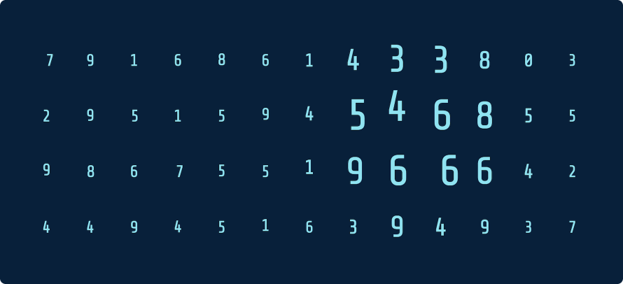
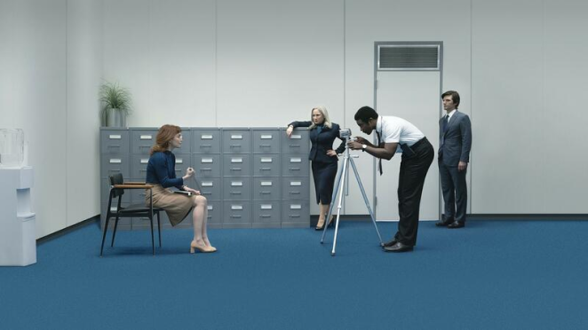
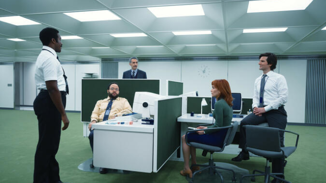
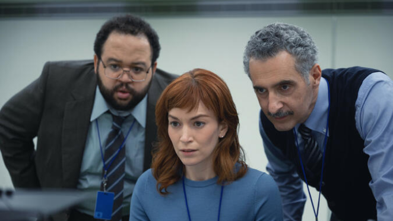
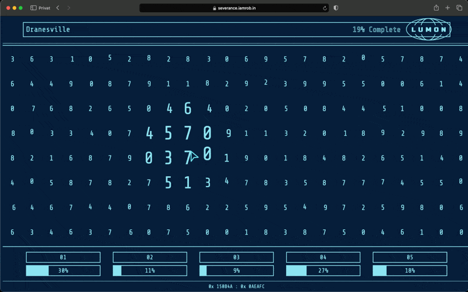
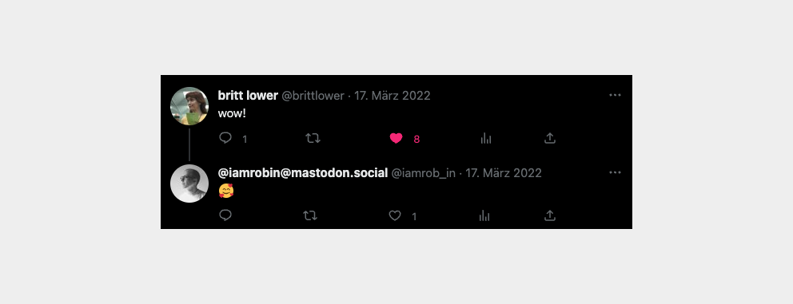

Engaging series, movies, or video games always get my creative juices flowing and make me want to create something inspired by them. That's exactly what happened when I watched the first season of the TV series "[Severance](https://tv.apple.com/de/show/severance/umc.cmc.1srk2goyh2q2zdxcx605w8vtx)" on Apple TV+. I was totally blown away by their software interface and just had to recreate it myself.

### The TV show
[Severance](https://tv.apple.com/de/show/severance/umc.cmc.1srk2goyh2q2zdxcx605w8vtx) is a US science fiction thriller television series. It was first released on Apple TV+ on February 18, 2022. The protagonists work in a company called Lumon, where all employees have undergone a procedure that separates their memory between work and private memories.

](../../assets/projects/lumon/03.png)

### The Interface

At work, Lumon employees operate specific software all day long. Neither they nor the viewers of the show know what exactly the software does. But that doesn't matter, it's just incredibly aesthetically pleasing and I just had to recreate it.

### Implementation

Since I time-boxed the project to one evening to avoid over-engineering and getting lost in perfectionism, the implementation is intentionally simple. It comprises an HTML page with CSS styling and basic JavaScript functionalities. There are no complex interactions or sophisticated logic involved. However, if you're curious about the code, it's accessible on my GitHub page.

[https://github.com/iam-robin/severance-interface](https://github.com/iam-robin/severance-interface)

### Feedback
I'm so proud of this fact, that I simply have to share it here on my personal website: [Britt Lower](https://en.wikipedia.org/wiki/Britt_Lower), the actress who plays one of the main character in the series, actually commented on my tweet about the project. It's beyond incredible!

[@iamrobin@mastodon.social on Twitter / X](https://twitter.com/iamrob_in/status/1503449840432336902)

