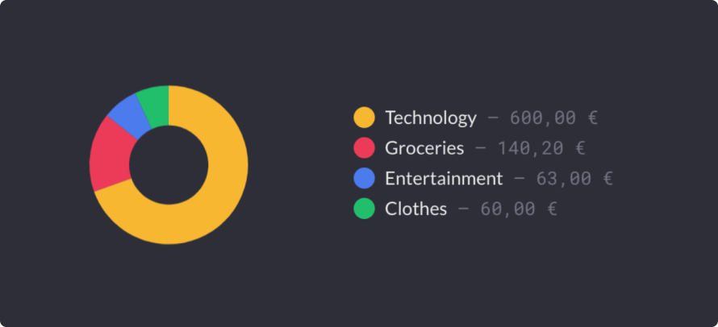
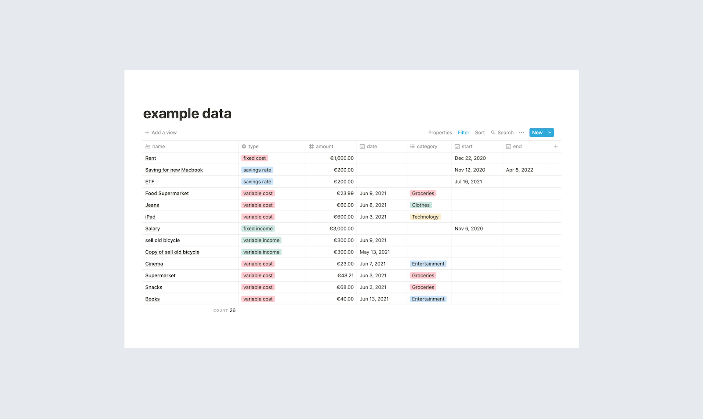
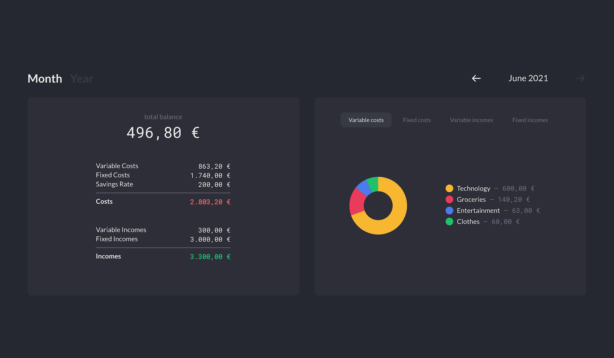
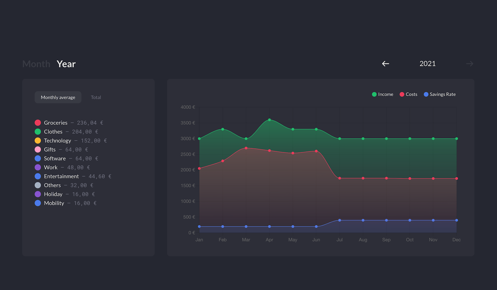

I've tracked my private financial expenses in a budget planner built with [Notion](https://www.notion.so/personal) for over a year. The release of the official Notion API enabled me to visualize this data in the form of a small web application to better analyze and evaluate the collected data.

The data shown in the following are all just for demonstation reason and do not reflect my real income and expenses.

### Data
I tracked all my expenses in Notion over a year to get a better overview of my finances. I distinguished between fixed costs and variable costs. Fixed costs, such as rent, electricity, Spotify and other digital subscriptions consist of a start date, the monthly cost and if canceled an end date. Variable costs such as food, clothes, leisure activities were entered manually with the amount of the expense and a label for categorization. Also included in the table are my fixed and variable incomes for each month.

### Application
In order to better evaluate the accumulated data, to recognize patterns and, in the best case, to better invest my money by adjusting my consumption behavior, I took the chance with the release of the official Notion API and built a small web application that visualizes exactly this data for me. The application is divided into two sections. The monthly and annual overview. In the monthly view, you can navigate between individual months. On the one hand, the total amount of money is displayed, which I have saved in this month and on the other hand an overview of how I spent the money. In the annual overview, the individual months can be compared with each other and average values for the categories are calculated to get a better overall feel for the data.

[https://github.com/iam-robin/notion-budget-planner](https://github.com/iam-robin/notion-budget-planner)
