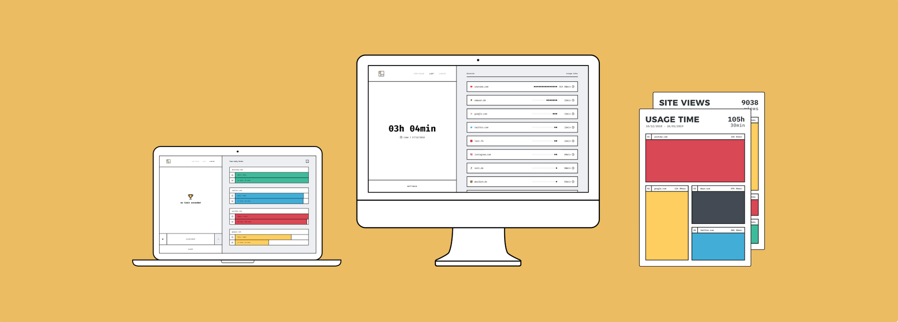
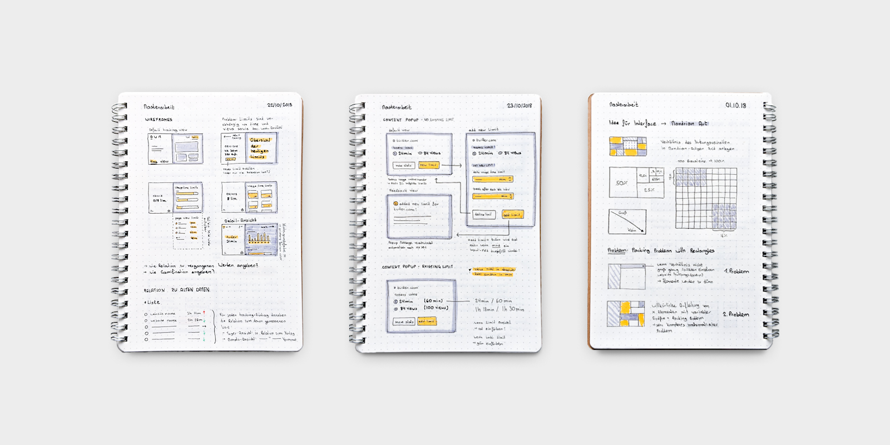
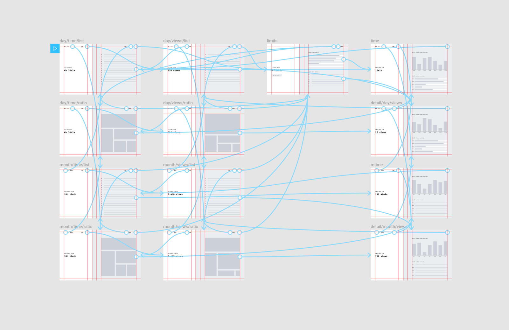
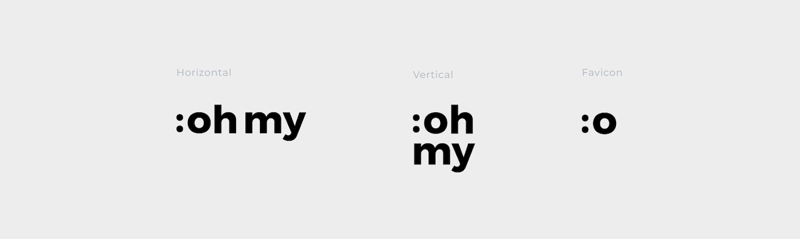
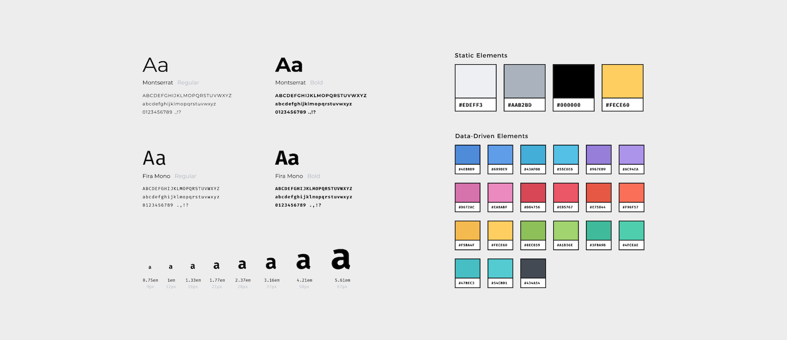
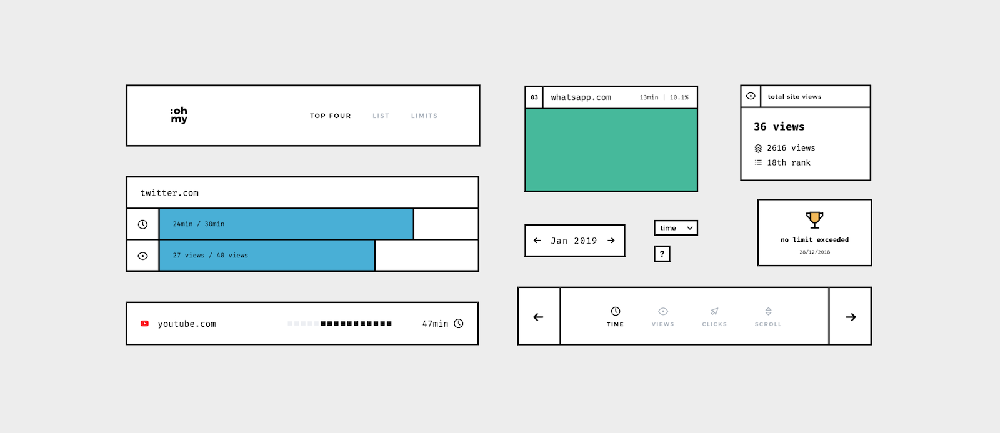
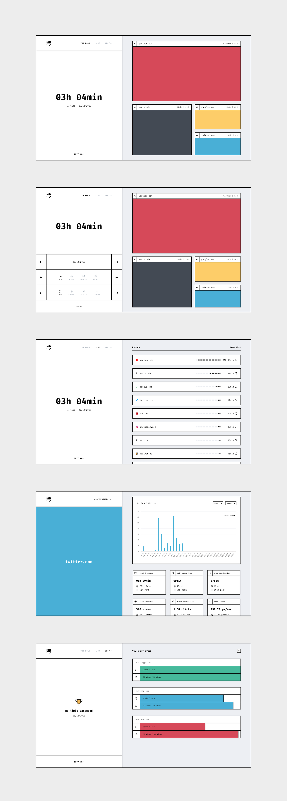

For my master's thesis, I built «oh my», a Vue.js browser extension that records browsing habits and shows them on the new tab page. It also lets people limit distracting sites after a set amount of time or number of visits.

### Concept
During the conception phase, wireframes were created for the user interface of the main application as well as for the pop-up window of the browser extension. Starting with pen and paper, the developed structure was then digitized and unified. Based on the static wireframes, an interactive prototype was then created with Figma.

### Identity
The name «oh my» refers to the expression «oh my god» and therefore to the surprise that awaits the user when he is confronted with his usage behavior. This idea is continued in the logo mark in the form of a shocked ASCII emoticon. When selecting colors and fonts for the application, attention was paid to a strict separation between user interface controls and data-driven information elements to ensure a good usability. In addition, a typescale of 1.333, also called «perfect forth», was used to achieve a harmonious relation of the font sizes.

### Components
To enable a fast design process through a modular structure, individual components were first designed in Figma and later technically implemented in Vue.js. Besides increasing efficiency, a component-based system has a direct impact on the quality of the application by ensuring a uniform and consistent user interface.

### Application

The main application of the browser extension was implemented with Vue.js and is shown after installing the extension on the new tab page of the browser. The background scripts of the extension determines the user behavior, processes the information and then stores it in the local storage. Thus, the collected data on user behavior never leaves the user's computer and can therefore not be misused. The user interface of the new tab page is divided into two areas within the complete application. The left area represents the control center of the application, which contains, among other things, the navigation and the settings menu. The right area serves as a canvas for the processed data. The display varies depending on the selected view, time period and data set.

